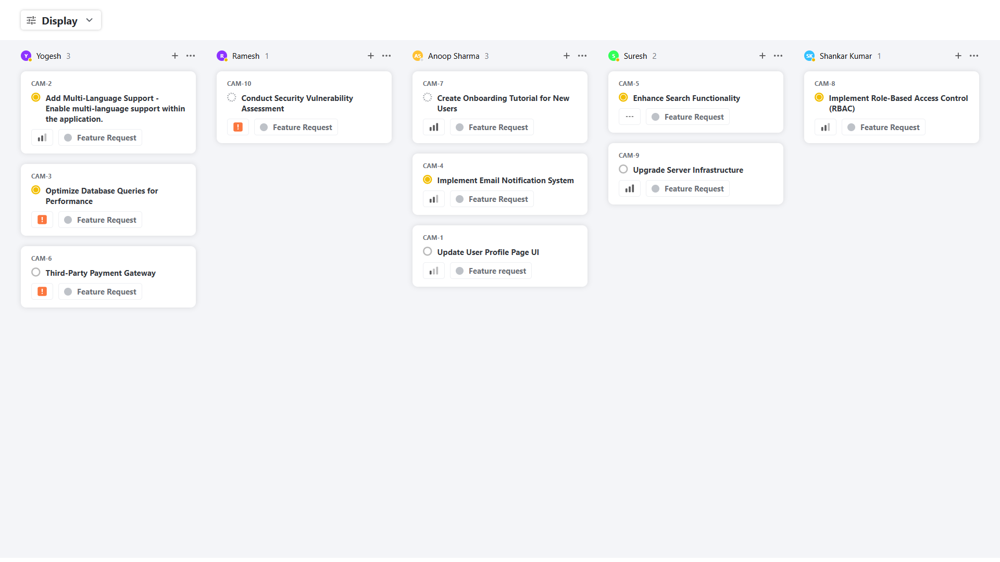
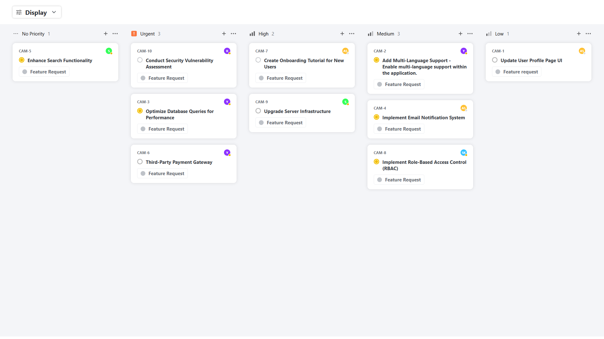
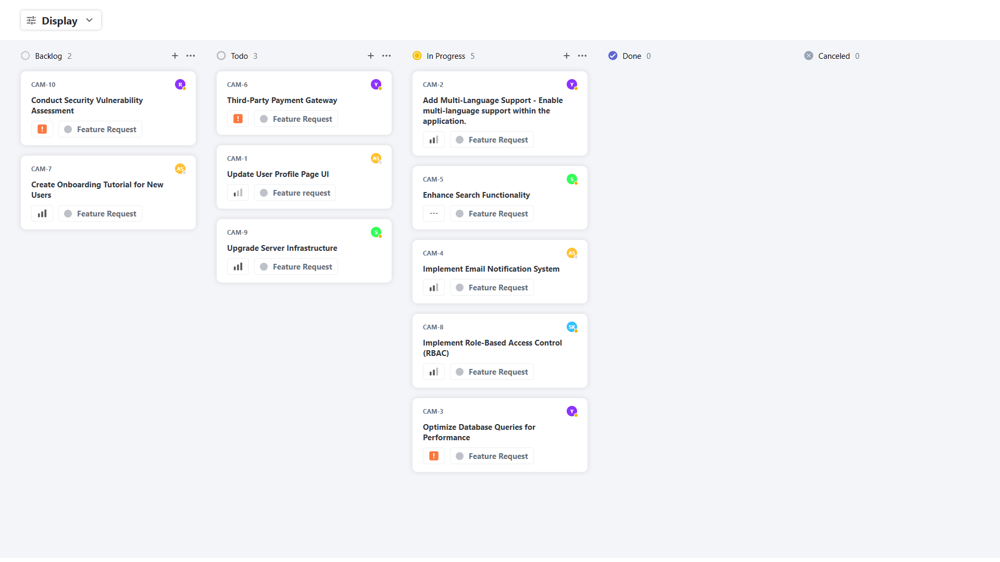

# QuickSell Frontend Assessment

## Overview

This repository contains the solution for the **QuickSell Frontend Assessment**, which involves creating an interactive **Kanban Board** using **ReactJS**. The Kanban board allows users to dynamically group and sort tickets based on various criteria, such as status, user, and priority. It integrates with an API to fetch ticket data and provides a visually appealing and responsive UI.

### Key Features:
- **Dynamic Grouping**: Group tickets by **Status**, **User**, or **Priority**.
- **Sorting Options**: Sort tickets by **Priority** or **Title**.
- **Responsive Design**: The application is designed to be fully responsive, ensuring an optimal experience on both desktop and mobile devices.
- **State Persistence**: User preferences for grouping and sorting are saved and persisted across page reloads.
- **API Integration**: Data is fetched from the provided API and displayed in real-time.

---

## Design Mockups

The UI is designed to match the provided mockups. The layout adjusts based on the selected grouping option, with the tickets displayed in different columns:

- **Grouping by User**  
  

- **Grouping by Priority**  
  

- **Grouping by Status**  
  

---

## Installation

To run the project locally, follow these steps:

### Prerequisites

Make sure you have **Node.js** and **npm** installed on your system.

### Setup

1. Clone this repository:

   ```bash
   git clone https://github.com/Vickykumar1001/QuickSell-Assessment.git
   cd QuickSell-Assessment

2. Install the dependencies:

   ```bash
   npm install
3. Start the development server:

   ```bash
   npm start

The app should now be running on http://localhost:3000